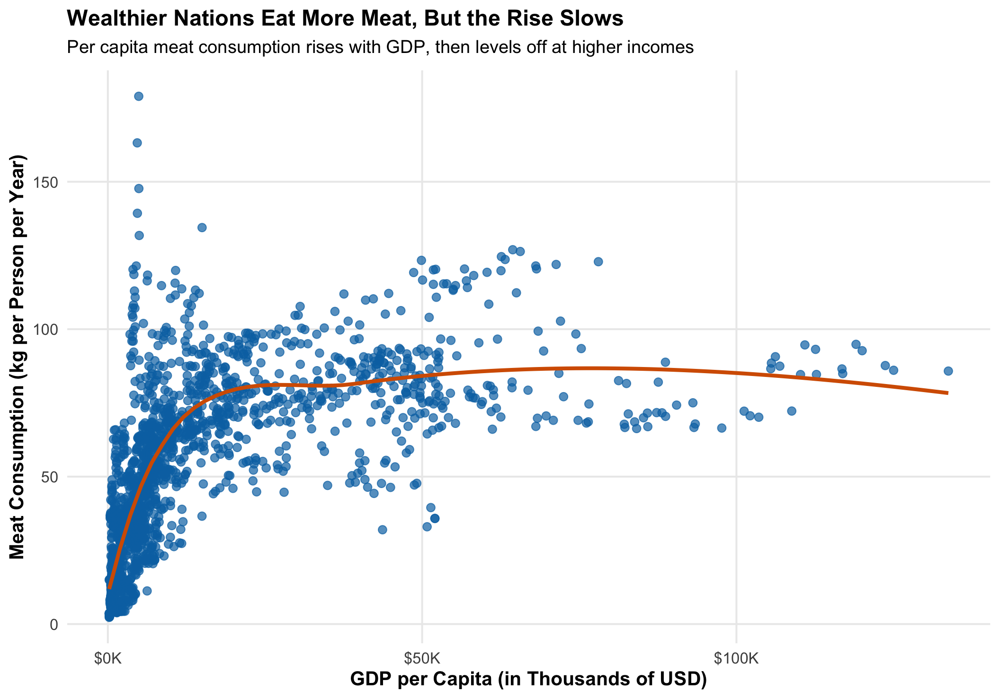
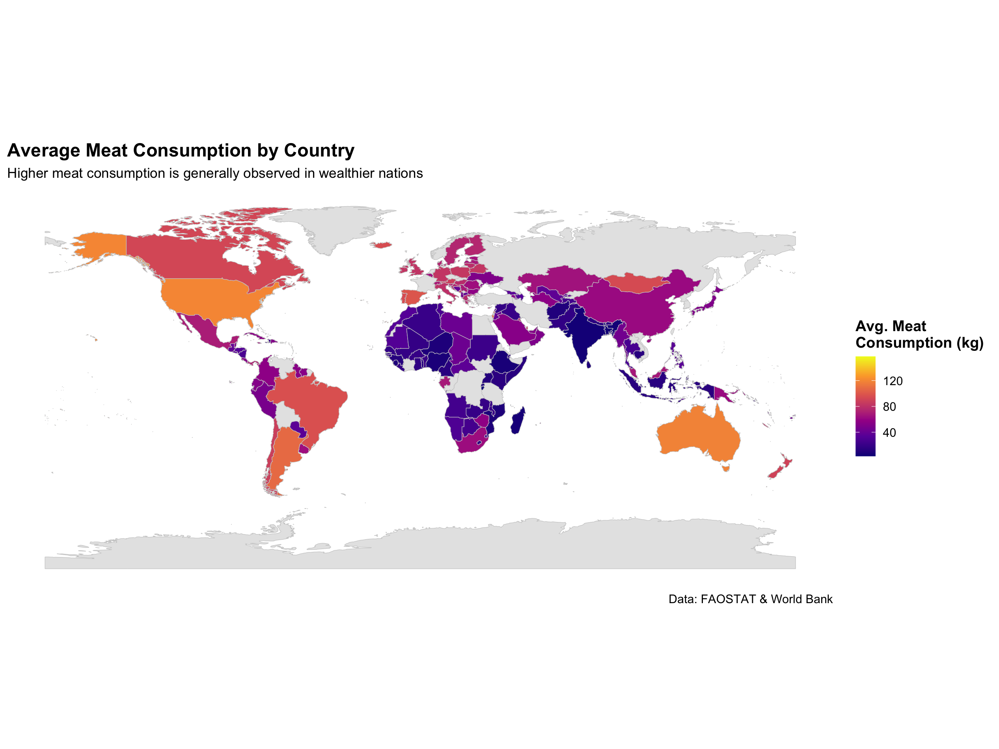

# 🌍 The Economics of Eating Meat: A Global Data Analysis

This project explores the relationship between a country's economic development and its per capita meat consumption using real-world data from **FAOSTAT** and the **World Bank**. The analysis combines data cleaning, visualization, and predictive modeling in **R** to uncover global trends in diet and accessibility.

---

## 👩‍💻 About Me

Hi! I'm Kyrie Huerta — an Economics major and Quantitative Data Analytics minor at Michigan State University. This project was inspired by personal experience and a passion for using data to explore real-world issues related to food access and health.

## 📁 Project Structure

```
├── data/ # CSV datasets from FAOSTAT and World Bank
│ ├── FAOSTAT_data_meat_consumption.csv
│ └── GDP.PER.CAPITA.csv
│
├── figures/ # Visualizations created in R
│ ├── scatterplot_GDPperCapita_MeatConsumption.png
│ ├── logGDPperCapita_MeatConsumption.png
│ ├── boxplotIncomeGroup_MeatConsumption.png
│ ├── MeatConsumptionMap.png
│ └── LassoRegression_MeatConsumption.png
│
├── meat_consumption_analysis.Rmd # Full analysis in RMarkdown
├── meat_consumption_analysis.R # Clean script with all analysis code
├── meat_consumption_analysis.pdf # Final report (no code)
└── README.md
```

## 📊 Tools & Packages Used

- `tidyverse`
- `janitor`
- `countrycode`
- `ggplot2`
- `glmnet` (for LASSO regression)

---

## 🔍 Key Findings

- **Higher GDP → More Meat**: Wealthier nations tend to consume more meat, but the trend flattens at higher incomes.
- **Biggest Jump**: The largest jump in consumption happens between low- and middle-income countries.
- **Predictive Power**: A simple LASSO model using log(GDP) explains ~63% of global meat consumption variation.

---

## 📸 Sample Visualizations

**1. GDP vs. Meat Consumption (Scatterplot)**  


**2. Global Meat Consumption Map**  


> View more plots in the [figures/](figures/) folder or the full PDF report.

---

## 📂 Data Sources

- [FAOSTAT: Food Supply - Meat Consumption](https://www.fao.org/faostat/en/#data)
- [World Bank: GDP per Capita](https://data.worldbank.org/indicator/NY.GDP.PCAP.CD)

---

## 📘 Full Report

📄 View the final report here: [meat_consumption_analysis.pdf](meat_consumption_analysis.pdf)

---

## 🚀 Future Improvements

- Add regional or cultural factors
- Explore time-series trends
- Compare meat types (e.g., beef vs. poultry)

---

## 🧠 Contact

huertaky@msu.edu
